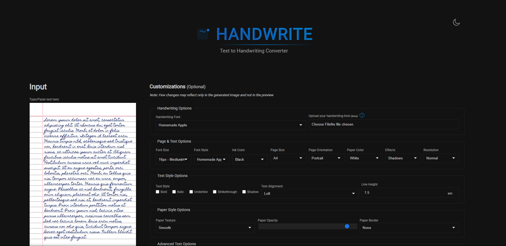

<div align="center">
  
  <h1>HandWrite</h1>
  <p>
    <b>Turn your typed text into authentic-looking handwriting!</b>
  </p>
  <p>
    <a href="https://github.com/vishangl/HandWrite/stargazers"></a>
    <a href="https://github.com/vishangl/HandWrite/network/members"></a>
    <a href="https://github.com/vishangl/HandWrite/blob/master/LICENSE"></a>
  </p>
</div>

---

<div align="center">
  
</div>

## 🚀 Why HandWrite?

Tired of writing assignments by hand? **HandWrite** is here to save the day! This tool converts your typed text into an image that looks exactly like it was written by hand. Whether you need to submit a "handwritten" note, create digital art, or just want to experiment with different handwriting styles, HandWrite offers a seamless and customizable experience.

## ✨ Features

### ✍️ Text-to-Handwriting
Instantly convert any typed text into a handwritten format. The tool supports dynamic text wrapping and paging.

### 🎨 Extensive Font Library
Choose from a wide variety of pre-loaded handwriting fonts to match your style:
*   **Clean & Neat**: Homemade Apple, Handlee
*   **Casual**: Caveat, Patrick Hand, Short Stack
*   **Artistic**: Shadows Into Light, Allura, Sacramento
*   **Bold**: Permanent Marker
*   **Decorative**: Great Vibes, Dancing Script
*   **International**: Liu Jian Mao Cao (Chinese style), Nanum Pen Script (Korean style), Hindi Fonts

### 📄 Paper Customization
Make it look like real paper with extensive options:
*   **Paper Type**: White, Cream, Light Blue.
*   **Texture**: Smooth, Rough, Lined, Grid, Dotted.
*   **Effects**:
    *   **Shadows**: Adds depth to the text.
    *   **Scanner**: Simulates a scanned document look.
    *   **Aged/Wrinkled**: Adds character to the paper (experimental).

### 🛠️ Advanced Customization
*   **Ink Color**: Blue, Black, Red, Green, and many more.
*   **Typography**: Adjust Font Size, Letter Spacing, and Word Spacing.
*   **Transform**: Uppercase, Lowercase, Capitalize.
*   **Orientation**: Portrait or Landscape modes.

### 🖼️ Drawing Canvas (Beta)
Need a diagram? Use the built-in drawing canvas to sketch figures, graphs, or doodles and insert them directly into your handwritten note.

## 📖 How to Use

1.  **Type Your Text**: Enter or paste your text into the input box on the left.
2.  **Customize**: Use the panel on the right to tweak your note:
    *   **Handwriting Font**: Select a font style from the dropdown.
    *   **Ink Color**: Choose your preferred ink color.
    *   **Font Size & Spacing**: Adjust size, word spacing, and letter spacing to fit your needs.
    *   **Paper Style**: Pick a background (lined, blank, grid) and texture.
3.  **Draw (Optional)**: Click the "Draw" button to sketch diagrams or doodles, then add them to your paper.
4.  **Generate**: Click "Generate Image" to see the final result.
5.  **Download**: Click "Download Image" to save as a PNG or "Download All Images as PDF" for a multi-page document.

## 💡 Advanced Usage: Custom Fonts

Want to use your *own* handwriting? You can!

1.  **Create a Font**: Use a tool like [Calligraphr](https://www.calligraphr.com/) to turn your handwriting into a font file (`.ttf` or `.otf`).
2.  **Upload**: In the "Handwriting Options" section, click "Upload your handwriting font".
3.  **Select**: Your custom font will be applied to the text immediately.

> **Pro Tip**: When creating your font, write each character multiple times to ensure natural variation if your font creation tool supports it.

## ❓ Troubleshooting

*   **Gaps between letters?**
    *   This can happen with some custom fonts. Use the **Letter Spacing** and **Word Spacing** controls to adjust the gaps until it looks natural.
*   **Text getting cut off?**
    *   Try reducing the **Font Size** or adjusting the **Vertical Position**.
*   **Multiple pages not generating correctly?**
    *   The tool attempts to split text across pages, but complex formatting might cause issues. Try processing smaller chunks of text if you encounter problems.

## 🛠️ Tech Stack & Development

This project is built using standard web technologies, making it easy to understand and contribute to.

*   **Frontend**:
    *    **HTML5**: Semantic structure.
    *    **CSS3**: Custom styling with responsive design and CSS variables for theming.
    *    **JavaScript (ES6+)**: Core logic using ES Modules (`.mjs`).
*   **Key Libraries**:
    *   `html2canvas`: Used to render the DOM (the "paper" view) into an image.
    *   `jspdf`: Used to compile generated images into a downloadable PDF file.
*   **Tools**:
    *   `npm`: Package management.
    *   `eslint` & `prettier`: Code linting and formatting.
    *   `cypress`: End-to-end testing.

## 🏃‍♂️ Getting Started for Developers

1.  **Clone the repo**
    ```bash
    git clone https://github.com/vishangl/HandWrite.git
    cd HandWrite
    ```

2.  **Install dependencies**
    ```bash
    npm install
    ```

3.  **Start the app**
    ```bash
    npm run dev
    ```
    This will start a local server (usually `serve`). Open the provided URL in your browser.

## 🤝 Contributing

We love contributions! If you have an idea for a new feature or found a bug, please check out our [CONTRIBUTING.md](CONTRIBUTING.md) guide.

1.  Fork the Project
2.  Create your Feature Branch (`git checkout -b feature/AmazingFeature`)
3.  Commit your Changes (`git commit -m 'Add some AmazingFeature'`)
4.  Push to the Branch (`git push origin feature/AmazingFeature`)
5.  Open a Pull Request

## 📜 License

Distributed under the MIT License. See `LICENSE` for more information.

---

<div align="center">
  Made with ❤️ by <a href="https://github.com/vishangl">Vishang Lad</a>
</div>